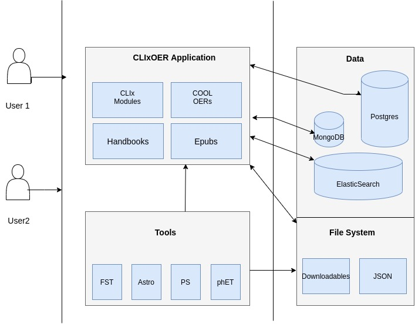

CLIxOER
==============

CLIxOER is an online platform through which CLIx modules and other OERs will be available to access online over the Internet.

The OERs here are CLIx artefacts that include,
  Modules in epub3
  Selected Videos
  PDF of handbooks
  Digital tools/interactives
  
The design, development, implementation, research aspects of each module as well as field testimonials will also be presented.

The website will be primarily presented in English (although most of the resourceswill be in English, Hindi & Telugu). Eventually Hindi/Telugu version to be made available for larger outreach.

Platform Design
===============

The website broady aims to cater to the following users:

Teachers 
Any teacher (school teacher) interested to know more about CLIx, the modules, and the process of module development in specific and OER creation in general. 

Learners
Primarily learners who have access to good internet connection.

General visitors
Any visitor who is keen on understanding the CLIx Modules and process of OER creation and/or to download the CLIx OER for purposes commensurate with the CLIx licensing (CC-BY 4.0 unless otherwise stated).

